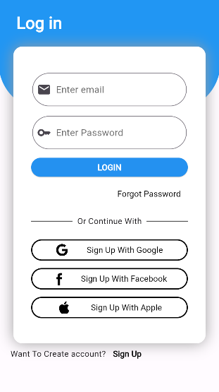
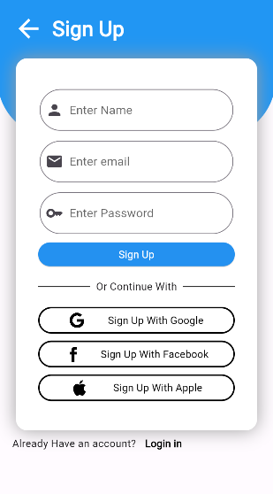

<h1>LoginScreens in Flutter</h1>
<table>
  <tr>
     <td>LoginScreen1</td>
     <td>SignupScreen</td>
     <td>ForgotPassword</td>
  </tr>
  <tr>
    <td></td>
    <td></td>
    <td></td>
  </tr>
 </table>
